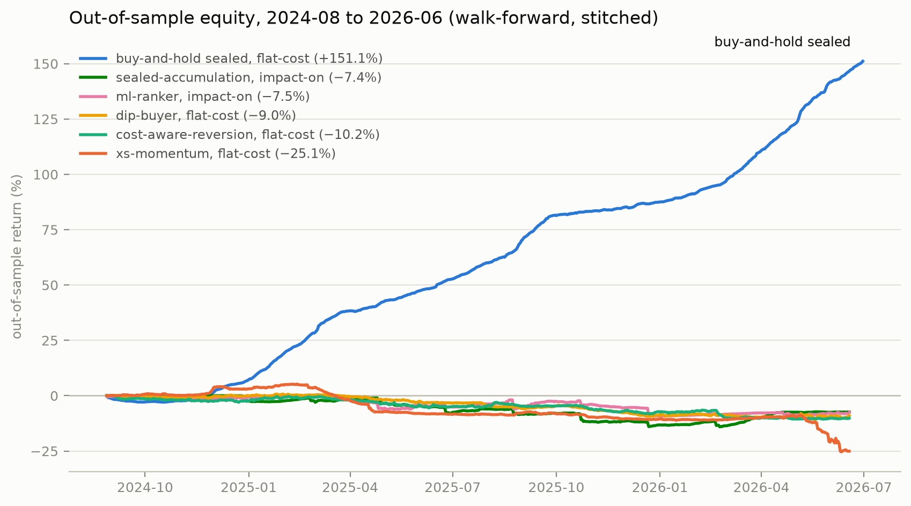
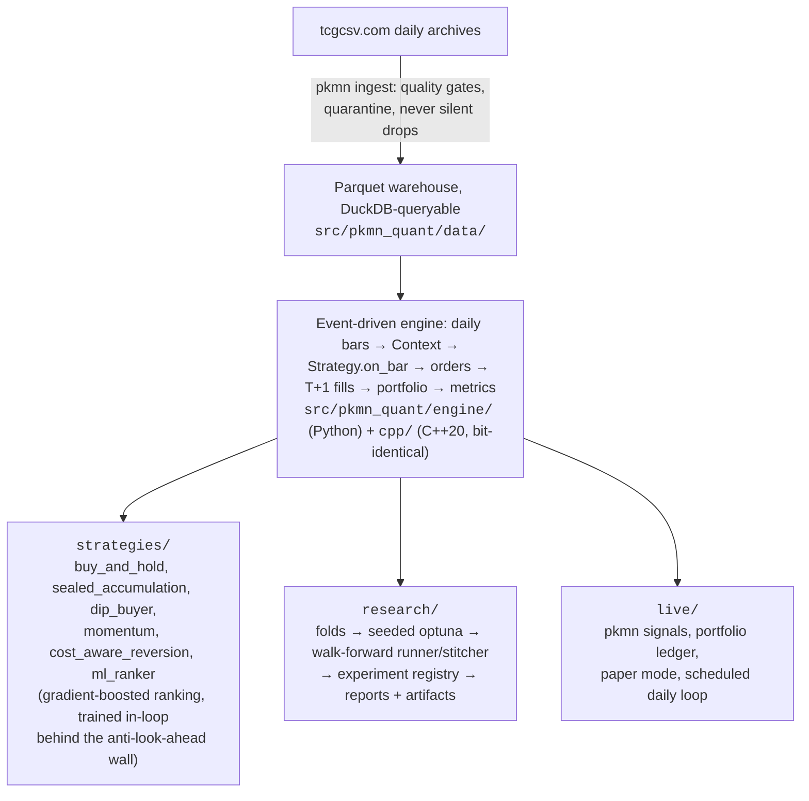
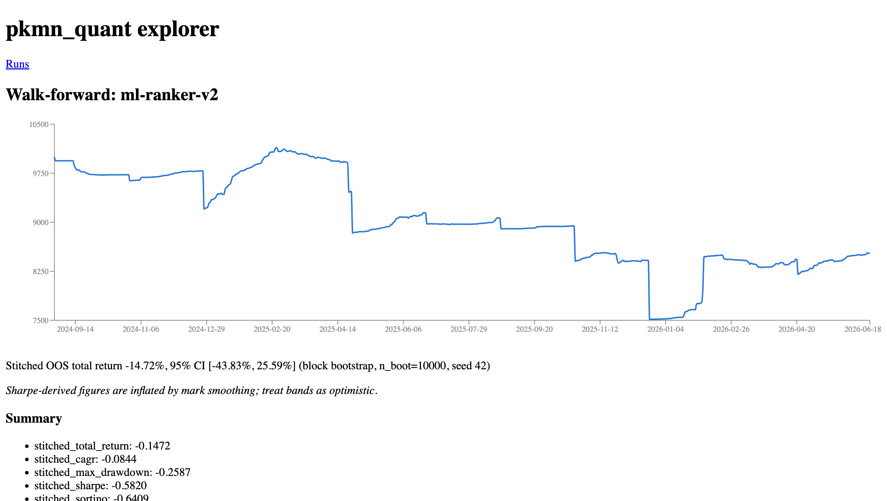

# pkmn_quant

**Event-driven backtesting for Pokemon card markets: a Python reference engine, a bit-for-bit-identical C++ engine, and walk-forward research honest enough to publish its own negative result.**

[](https://github.com/mlhv/pkmn-stock/actions/workflows/ci.yml)


<p align="center">
  
</p>

*Stitched out-of-sample equity, 2024-08 to 2026-06. Each strategy shows its most rigorous available run: sealed-accumulation and ml-ranker include the market-impact cost model, the rest are flat-cost, and the legend says which. Regenerate with `uv run --group viz python scripts/render_readme_chart.py`.*

## What this is

A quant research system for TCGplayer card prices (via tcgcsv.com), built end to end:

- **A custom event-driven backtest engine**: daily bars, T+1 fills, long-only, integer quantities, per-day liquidity caps tiered by price, ~12.75% sell fees plus shipping, and a walk-the-spread market-impact model that prices order size against the book.
- **A native C++20 engine** (nanobind) that reproduces the Python engine **bit for bit**. Every fill and every equity value must match with `==`, never a tolerance, enforced at three levels (unit, differential, full-data acceptance).
- **An 18x faster research loop**: a full walk-forward dropped from 6 minutes to 20 seconds, measured on the real 874-day warehouse, with fold-level parallelism that releases the GIL on the native path.
- **Walk-forward validation only**: seeded optuna tunes parameters in-sample, they are frozen, then tested strictly out-of-sample. The headline curve contains zero in-sample days and every run reports its overfitting gap.
- **An experiment registry**: every run appends its config hash, git SHA, data fingerprint, and results to an append-only log (`pkmn runs list` / `pkmn runs show`), so any number in this README is reproducible.

> **The honest headline:** across 2024-08 to 2026-06, no active strategy beat buy-and-hold sealed product (+151% out-of-sample, flat-cost). With the market-impact model on (the current default), it gets worse: both previously-positive strategies (sealed-accumulation +13.6%, ml-ranker +6.0%) flip negative out-of-sample (−7.4%, −7.5%) once trades are priced against the book, while buy-and-hold barely moves (+186.0% to +183.7% full-period). The system's value is that it can prove results honestly: out-of-sample discipline, transaction-cost and market-impact realism, an explicit overfitting measurement, and reproducibility from a config hash.

## Results (walk-forward, out-of-sample only)

Two regimes: **flat-cost** (2026-07-11 runs, no market-impact model) and **impact-on** (2026-07-14 runs, the walk-the-spread model, now the CLI default). Run IDs for the impact-on rows are in `data/runs/registry.jsonl` and cited in the findings doc.

| Strategy             | Stitched OOS, flat-cost | Stitched OOS, impact-on |
|----------------------|-------------------------:|--------------------------:|
| buy-and-hold sealed  | **+151.1%**              | *(not re-run walk-forward; full-period backtest +186.0% → +183.7%)* |
| sealed-accumulation  | +13.6%                   | **−7.4%**                  |
| ml-ranker            | +6.0%                    | **−7.5%**                  |
| dip-buyer            | −9.0%                    | *(not re-run under impact)* |
| cost-aware-reversion | −10.2%                   | *(not re-run under impact)* |
| xs-momentum          | −25.1%                   | *(not re-run under impact)* |

11 folds each: optimize 180 days in-sample, freeze params, test 60 days out-of-sample, roll, stitch the OOS segments. The overfitting gap (mean IS CAGR minus mean OOS CAGR) is reported on every run. Full findings and caveats: [docs/research-findings-2026-07.md](docs/research-findings-2026-07.md).

## Why the numbers are believable

- **No look-ahead by construction:** strategies receive a `Context` (history up to today, positions, cash) and cannot tell backtest from live mode.
- **Cost realism:** ~15% round-trip friction before impact; the impact model walks fills from `market` toward `mid` (buys) or `low` (sells), scaled by order size against the daily liquidity cap. Opt out per-command with `--no-impact`.
- **Walk-forward only:** parameters are frozen before touching out-of-sample data; zero in-sample days in the headline curve.
- **Reproducible:** every run's config hash, git SHA (+dirty flag), and data fingerprint land in the registry.
- **Stated limitations:** ~2.4 years of data, one bull regime for sealed; Sharpe/Sortino are inflated by thin-market mark smoothing (documented in every report); stitched seams assume mark-value carryover without liquidation costs. Methodology over significance.

## Architecture



The market-impact model lives in `engine/quotes.py`: a per-day `Quote` (mid/low) feeds walk-the-spread pricing (engine default off, CLI default on). Data throughout the pipeline is polars-backed; `research/features.py` adds 8 leakage-bounded features for ml-ranker (scikit-learn).

## Two engines, one result

The Python engine (`engine/backtest.py`) is the always-available reference. The C++ engine (`cpp/`, bound as `pkmn_quant._engine`) ports all five strategies natively; select it with `--engine cpp` (the default since Plan 11). Anything else, including any raw Python `Strategy` such as ml-ranker, still runs correctly on the C++ event loop through a per-bar callback bridge.

**The parity guarantee is bit-for-bit, not "close enough".** Every fill's day, asset, quantity, price, fees, and impact, and every equity-curve value, must match exactly (`==`). Enforced three ways: Catch2 unit tests on the C++ core in isolation, differential tests across both engines for every strategy, and a full-data acceptance script over the real 874-day warehouse:

```bash
uv run python scripts/parity_full.py        # five rule strategies, ~1 min
uv run python scripts/parity_full.py --ml   # + ml-ranker bridge, ~2-3 min
```

The full-data acceptance run surfaced a real gap the synthetic fixtures never exercised: 40 priced product_ids inside the backtest window (1,845 warehouse-wide as of that run) had no matching `products.parquet` catalog row. Both engines now tag missing catalog rows kind `other`, so they agree bit-for-bit on which assets are tradeable; details in the findings doc's Plan 10 section.

**Measured single-backtest speedup** (best of 3, full 2024-03 to 2026-06 range, impact on, total wall-clock including the one-time data load):

| strategy | python (s) | cpp (s) | speedup |
|---|---|---|---|
| buy-and-hold | 10.34 | 4.37 | 2.4x |
| sealed-accumulation | 11.91 | 3.52 | 3.4x |
| dip-buyer | 27.44 | 3.60 | 7.6x |

**Measured walk-forward speedup** (`scripts/bench_walkforward.py`, sealed-accumulation, 11 folds, 15 trials per fold):

| config | wall-clock (s) | speedup |
|---|---|---|
| python, serial | 359.5 | 1.0x |
| cpp, serial | 20.0 | 18.0x |
| cpp, workers=auto | 20.5 | 17.5x |

`--workers` controls fold-level parallelism (0 = auto, 1 = serial, N = N threads); results are bit-identical at any worker count, and the serial/parallel equality is checked on real data by the benchmark itself. The honest detail: the 18x is almost entirely the native engine plus a data-prep hoist, not threads; the findings doc's Plan 11 section explains why. Use `--engine python --workers 1` for the reference behavior.

Build notes: `uv sync` builds the extension automatically (scikit-build-core + nanobind, CMake ≥ 3.26). For direct C++ iteration:

```bash
cmake -S cpp -B cpp/build -DPKMN_BUILD_TESTS=ON && cmake --build cpp/build -j
ctest --test-dir cpp/build --output-on-failure
```

## Quickstart

```bash
uv sync                                                   # installs everything, builds the C++ extension
uv run pytest                                             # 349 tests (+1 dashboard skip without --group dashboard)
uv run pkmn ingest --start 2024-02-08 --end 2026-06-30    # ~40 min, ~2.9M price rows
uv run pkmn backtest --start 2024-03-01 --end 2026-06-30  # benchmark backtest (cpp engine, impact on)
uv run pkmn walkforward --strategy sealed-accumulation \
    --start 2024-03-01 --end 2026-06-30 --trials 15       # research run (fold-parallel by default)
uv run pkmn signals --strategy sealed-accumulation        # today's recommendations
uv run pkmn runs list                                     # experiment registry
uv run pkmn portfolio show                                # real positions + P&L
uv run pkmn daily --skip-ingest --paper                   # paper-trade the full loop, offline
uv run --group dashboard streamlit run app/dashboard.py   # results explorer
```

<details>
<summary><strong>Scheduling the daily loop (macOS launchd)</strong></summary>

    sed "s|REPO_PATH|$(pwd)|" scripts/com.pkmn-quant.daily.plist \
        > ~/Library/LaunchAgents/com.pkmn-quant.daily.plist
    launchctl load ~/Library/LaunchAgents/com.pkmn-quant.daily.plist

Runs `pkmn daily` at 09:00 (or on next wake, if the Mac was asleep at 09:00):
ingests new prices, runs signals against your ledger (`pkmn portfolio ...`),
and sends a macOS notification when there is something to act on, or when the
run fails.

Troubleshooting:

    launchctl start com.pkmn-quant.daily                        # fire immediately to test
    launchctl list | grep pkmn-quant                            # loaded? last exit code?
    launchctl unload ~/Library/LaunchAgents/com.pkmn-quant.daily.plist   # required before re-loading an edited plist

</details>

<details>
<summary><strong>Paper trading before real money</strong></summary>

Before committing real cash, run the loop with `--paper` first
(`uv run pkmn daily --skip-ingest --paper`, or a second launchd job pointing
at the same repo).  Paper mode routes all ledger reads and writes to
`data/portfolio/paper.jsonl`, auto-records fills using the same CostModel
as the backtester (shipping, marketplace fee, per-day liquidity cap), and
labels every output surface PAPER: the dashboard alerts strip, notification
titles, and the `daily-{date}-paper/` artifact directory.  Fill counts in
`daily.json` reflect recorded fills only (after liquidity and affordability
clipping, not raw recommendations), so a paper day where every order clips to
zero sends no notification.  Use it to watch the strategy trade fake money
through the identical pipeline before you act on any real recommendation.
All five strategies (sealed-accumulation, dip-buyer, cost-aware-reversion,
xs-momentum, ml-ranker) are portfolio-safe: each supports `--portfolio` for
exit signals against a real ledger and works with the paper daily loop.

</details>

## Web explorer

A read-only research explorer over the experiment registry and walk-forward/
evaluate artifacts: browse recorded runs, drill into a single walk-forward
run's folds/equity curve/rigor CI, and compare the full strategy zoo's
deflated-Sharpe/Reality-Check numbers side by side. Stack: FastAPI
(`src/pkmn_quant/api/`, 5 endpoints) serving Pydantic-typed JSON, and a
React/TS single-page app (`web/`, 3 screens) with its own toolchain.

One-command dev (runs both the API and the web dev server together, Ctrl-C
stops both):

```bash
make web
```



This is a viewer only — read-only, no data writes, and it does not claim any
strategy beats buy-and-hold. Triggering new runs from the browser is planned
for a later phase (Plan 2), not implemented here.

## Engineering practices

- `uv` for everything; `ruff` lint + format; `mypy --strict` on `src/`; pytest + Catch2; CI runs all gates with `uv sync --frozen`.
- Golden regression tests pin exact engine numbers; any drift fails loudly.
- Frozen dataclasses for value objects; every backtest `Result` carries its cost model, so a run's assumptions travel with its numbers.
- Two-stage review per task and a written plan per feature (see `docs/superpowers/`).

## Future work

- Multi-marketplace data (eBay, PSA-graded)
- Docker
