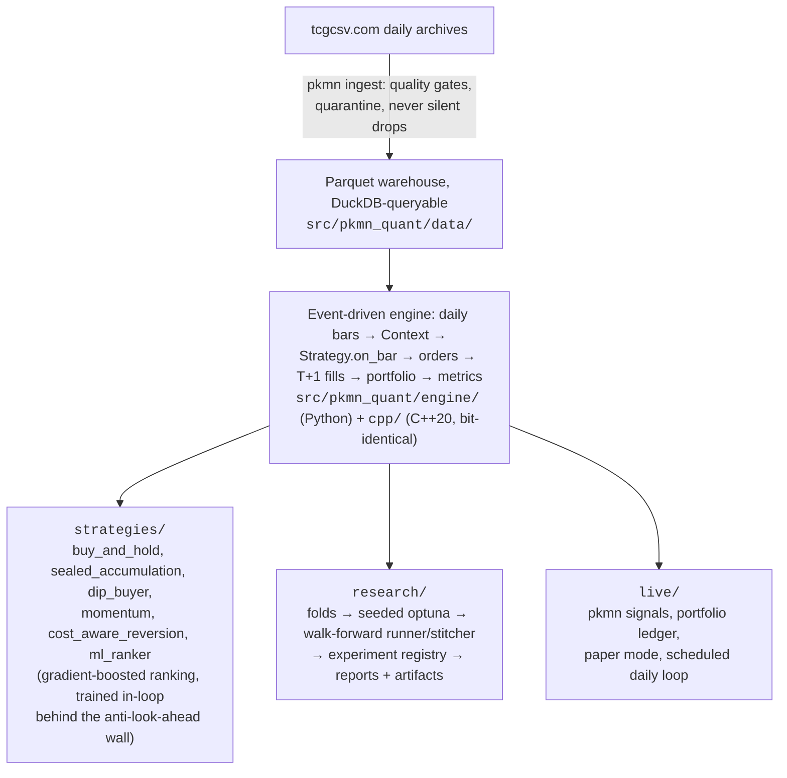

# README Revamp Implementation Plan

> **For agentic workers:** REQUIRED SUB-SKILL: Use superpowers:subagent-driven-development (recommended) or superpowers:executing-plans to implement this plan task-by-task. Steps use checkbox (`- [ ]`) syntax for tracking.

**Goal:** Restructure `README.md` for a 30-60 second recruiter skim (badges, hero chart, engineering-first framing) while preserving every existing fact, plus a small script that renders the hero chart from real local artifacts.

**Architecture:** Two independent deliverables. Task 1 adds `scripts/render_readme_chart.py` (reads gitignored `data/results/` walk-forward artifacts, writes the committed `docs/assets/oos_equity.png`) behind a new `viz` dependency group. Task 2 replaces `README.md` with the restructured version that embeds the chart.

**Tech Stack:** matplotlib (new, `viz` group only), polars, GitHub-flavored markdown (mermaid, `<details>`, shields.io badges).

**Spec:** `docs/superpowers/specs/2026-07-18-readme-revamp-design.md`. Read it before starting any task.

## Global Constraints

- **No em dashes anywhere in README prose or the chart** (user's prose-style rule). Use colons, commas, or "to" (e.g. "2024-08 to 2026-06"). The Unicode minus in negative numbers (−7.4%) is NOT an em dash and stays.
- **No invented or oversold numbers.** Every figure in the new README must already exist in the current README, `docs/research-findings-2026-07.md`, or the artifact files this plan names. If a number you want is not in those places, leave it out.
- **Do NOT run any walkforward to "unify" chart regimes.** A flat-cost re-run writes into the same `data/results/wf-<strategy>-...` dir and would destroy the impact-on artifacts. The chart's mixed regimes are deliberate and labeled.
- Every current README fact survives somewhere (re-homed, tightened, or moved into a `<details>` block), never dropped. The Sharpe/Sortino mark-smoothing caveat and the stated-limitations content must remain visible (not inside `<details>`).
- All four gates before every commit: `uv run pytest && uv run ruff check . && uv run ruff format --check . && uv run mypy`. `pyproject.toml` and `uv.lock` are committed together (CI runs `uv sync --frozen`).
- Current baselines: pytest 349 passed + 1 skipped; ctest 25/25. No behavior-changing code in this plan; the suite must be untouched.
- Branch: `chore/runtime-resolved-and-readme` (already checked out; spec committed).

## File Map

Created:
- `scripts/render_readme_chart.py` — renders the hero chart
- `docs/assets/oos_equity.png` — the committed hero image (binary)

Modified:
- `pyproject.toml` + `uv.lock` — new `viz` dependency group (matplotlib)
- `README.md` — full restructure (Task 2)
- `CLAUDE.md` — one Commands line for the chart script (Task 1)

---

### Task 1: Hero chart script + rendered PNG

**Files:**
- Create: `scripts/render_readme_chart.py`, `docs/assets/oos_equity.png`
- Modify: `pyproject.toml` (+ `uv.lock`), `CLAUDE.md` (one line in Commands)

**Interfaces:**
- Consumes: local artifacts (all verified to exist with schema `{date: Date, equity: Float64}`):
  - `data/results/buy-and-hold-sealed-2024-08-28-2026-06-30/equity.parquet` (flat-cost backtest, 10000.0 → 25110.03 = +151.1%)
  - `data/results/wf-sealed-accumulation-2024-03-01-2026-06-30/stitched_equity.parquet` (impact-on, −7.4%)
  - `data/results/wf-ml-ranker-2024-03-01-2026-06-30/stitched_equity.parquet` (impact-on, −7.5%)
  - `data/results/wf-dip-buyer-2024-03-01-2026-06-30/stitched_equity.parquet` (flat-cost, −9.0%)
  - `data/results/wf-cost-aware-reversion-2024-03-01-2026-06-30/stitched_equity.parquet` (flat-cost, −10.2%)
  - `data/results/wf-xs-momentum-2024-03-01-2026-06-30/stitched_equity.parquet` (flat-cost, −25.1%)
- Produces: `docs/assets/oos_equity.png`, embedded by Task 2 as `docs/assets/oos_equity.png`.

- [ ] **Step 1: Add the viz dependency group**

In `pyproject.toml`, find the `[dependency-groups]` table (it already has `dashboard`) and add:

```toml
viz = ["matplotlib>=3.9"]
```

Run: `uv sync --group viz` (updates `uv.lock`; expect matplotlib installed).

- [ ] **Step 2: Write the script**

`scripts/render_readme_chart.py` (complete file):

```python
"""Render docs/assets/oos_equity.png, the README hero chart.

Reads walk-forward artifacts under data/results/ (gitignored; needs a local
warehouse that has produced them) and plots out-of-sample equity as percent
return. Each strategy uses its latest local artifact, so the cost regime
differs per series and is named in the legend, mirroring the README results
table. Re-running flat-cost walkforwards to unify regimes would overwrite
the impact-on artifacts in the same result dirs, so the mix is deliberate.

Colors are categorical slots 1-6 (light mode) of the reference dataviz
palette, validated 2026-07-18 (adjacent CVD dE >= 9.1, normal-vision
dE >= 19.6). Three slots sit below 3:1 contrast on this surface; the
README's results table directly below the image is the required relief.

Usage: uv run --group viz python scripts/render_readme_chart.py
"""

from __future__ import annotations

import sys
from pathlib import Path

import matplotlib
import polars as pl

matplotlib.use("Agg")
import matplotlib.pyplot as plt  # noqa: E402  (backend must be set first)

SURFACE = "#fcfcfb"
INK_PRIMARY = "#0b0b0b"
INK_SECONDARY = "#52514e"
INK_MUTED = "#898781"
GRID = "#e1e0d9"
BASELINE = "#c3c2b7"

SERIES: list[tuple[str, str, str]] = [
    (
        "data/results/buy-and-hold-sealed-2024-08-28-2026-06-30/equity.parquet",
        "buy-and-hold sealed, flat-cost (+151.1%)",
        "#2a78d6",
    ),
    (
        "data/results/wf-sealed-accumulation-2024-03-01-2026-06-30/stitched_equity.parquet",
        "sealed-accumulation, impact-on (−7.4%)",
        "#008300",
    ),
    (
        "data/results/wf-ml-ranker-2024-03-01-2026-06-30/stitched_equity.parquet",
        "ml-ranker, impact-on (−7.5%)",
        "#e87ba4",
    ),
    (
        "data/results/wf-dip-buyer-2024-03-01-2026-06-30/stitched_equity.parquet",
        "dip-buyer, flat-cost (−9.0%)",
        "#eda100",
    ),
    (
        "data/results/wf-cost-aware-reversion-2024-03-01-2026-06-30/stitched_equity.parquet",
        "cost-aware-reversion, flat-cost (−10.2%)",
        "#1baf7a",
    ),
    (
        "data/results/wf-xs-momentum-2024-03-01-2026-06-30/stitched_equity.parquet",
        "xs-momentum, flat-cost (−25.1%)",
        "#eb6834",
    ),
]

OUT = Path("docs/assets/oos_equity.png")


def main() -> int:
    missing = [p for p, _, _ in SERIES if not Path(p).exists()]
    if missing:
        for p in missing:
            print(f"missing artifact: {p}", file=sys.stderr)
        print("run from the repo root with a populated data/results/", file=sys.stderr)
        return 2

    fig, ax = plt.subplots(figsize=(10.0, 5.2), dpi=200)
    fig.set_facecolor(SURFACE)
    ax.set_facecolor(SURFACE)

    for path, label, color in SERIES:
        df = pl.read_parquet(path)
        pct = (df["equity"] / df["equity"][0] - 1.0) * 100.0
        ax.plot(df["date"], pct, color=color, linewidth=2.0, label=label)

    bench = pl.read_parquet(SERIES[0][0])
    end_pct = (bench["equity"][-1] / bench["equity"][0] - 1.0) * 100.0
    ax.annotate(
        "buy-and-hold sealed",
        xy=(bench["date"][-1], end_pct),
        xytext=(-8, 10),
        textcoords="offset points",
        ha="right",
        color=INK_PRIMARY,
        fontsize=9,
    )

    ax.axhline(0.0, color=BASELINE, linewidth=1.0, zorder=1)
    ax.grid(axis="y", color=GRID, linewidth=0.75)
    ax.set_axisbelow(True)
    for side in ("top", "right", "left"):
        ax.spines[side].set_visible(False)
    ax.spines["bottom"].set_color(BASELINE)
    ax.tick_params(colors=INK_MUTED, labelsize=9)
    ax.set_ylabel("out-of-sample return (%)", color=INK_MUTED, fontsize=9)
    ax.set_title(
        "Out-of-sample equity, 2024-08 to 2026-06 (walk-forward, stitched)",
        color=INK_PRIMARY,
        fontsize=12,
        loc="left",
        pad=12,
    )
    ax.legend(frameon=False, fontsize=8.5, labelcolor=INK_SECONDARY, loc="upper left")

    OUT.parent.mkdir(parents=True, exist_ok=True)
    fig.savefig(OUT, facecolor=fig.get_facecolor(), bbox_inches="tight")
    print(f"wrote {OUT}")
    return 0


if __name__ == "__main__":
    sys.exit(main())
```

- [ ] **Step 3: Run it and verify the output numbers**

```bash
uv run --group viz python scripts/render_readme_chart.py
```

Expected: `wrote docs/assets/oos_equity.png`, exit 0.

Then LOOK at the image (Read `docs/assets/oos_equity.png` as an image). Check: benchmark line ends near +151 with its direct label not clipped or colliding; five active lines cluster near/below 0; legend readable in the upper left and not covering the benchmark line's rise; no label collisions; title and axis text legible.

If the legend overlaps the benchmark line, move it with `loc="center left"`; if the annotation clips, increase the `xytext` offsets. Re-render and re-look until clean.

- [ ] **Step 4: CLAUDE.md pointer**

Add one line to CLAUDE.md's Commands block, after the `bench_walkforward.py` line if present, else at the end of the block:

```
uv run --group viz python scripts/render_readme_chart.py   # regenerate README hero chart from local artifacts
```

- [ ] **Step 5: Gates, commit**

```bash
uv run pytest && uv run ruff check . && uv run ruff format --check . && uv run mypy
git add scripts/render_readme_chart.py docs/assets/oos_equity.png pyproject.toml uv.lock CLAUDE.md
git commit -m "feat: README hero chart script + rendered OOS equity PNG (viz dep group)"
```

Expected: 349 passed + 1 skipped (unchanged; the script has no tests, matching `scripts/` precedent, and is outside mypy's `files = ["src"]` scope but must be ruff-clean).

---

### Task 2: The restructured README

**Files:**
- Modify: `README.md` (full replacement)

**Interfaces:**
- Consumes: `docs/assets/oos_equity.png` (Task 1).

- [ ] **Step 1: Replace README.md with exactly this content**

The content below IS the deliverable; it was written against the style rules (no em dashes, short paragraphs, every fact carried over). Transcribe it verbatim. The two `<!-- ... -->` markers are the ONLY places you fill something in: each names its source section in the CURRENT README, from which you move the text unchanged.

````markdown
# pkmn_quant

**Event-driven backtesting for Pokemon card markets: a Python reference engine, a bit-for-bit-identical C++ engine, and walk-forward research honest enough to publish its own negative result.**

[](https://github.com/mlhv/pkmn-stock/actions/workflows/ci.yml)


<p align="center">
  
</p>

*Stitched out-of-sample equity, 2024-08 to 2026-06. Each strategy shows its most rigorous available run: sealed-accumulation and ml-ranker include the market-impact cost model, the rest are flat-cost, and the legend says which. Regenerate with `uv run --group viz python scripts/render_readme_chart.py`.*

## What this is

A quant research system for TCGplayer card prices (via tcgcsv.com), built end to end:

- **A custom event-driven backtest engine**: daily bars, T+1 fills, long-only, integer quantities, per-day liquidity caps tiered by price, ~12.75% sell fees plus shipping, and a walk-the-spread market-impact model that prices order size against the book.
- **A native C++20 engine** (nanobind) that reproduces the Python engine **bit for bit**. Every fill and every equity value must match with `==`, never a tolerance, enforced at three levels (unit, differential, full-data acceptance).
- **An 18x faster research loop**: a full walk-forward dropped from 6 minutes to 20 seconds, measured on the real 874-day warehouse, with fold-level parallelism that releases the GIL on the native path.
- **Walk-forward validation only**: seeded optuna tunes parameters in-sample, they are frozen, then tested strictly out-of-sample. The headline curve contains zero in-sample days and every run reports its overfitting gap.
- **An experiment registry**: every run appends its config hash, git SHA, data fingerprint, and results to an append-only log (`pkmn runs list` / `pkmn runs show`), so any number in this README is reproducible.

> **The honest headline:** across 2024-08 to 2026-06, no active strategy beat buy-and-hold sealed product (+151% out-of-sample, flat-cost). With the market-impact model on (the current default), it gets worse: both previously-positive strategies (sealed-accumulation +13.6%, ml-ranker +6.0%) flip negative out-of-sample (−7.4%, −7.5%) once trades are priced against the book, while buy-and-hold barely moves (+186.0% to +183.7% full-period). The system's value is that it can prove results honestly: out-of-sample discipline, transaction-cost and market-impact realism, an explicit overfitting measurement, and reproducibility from a config hash.

## Results (walk-forward, out-of-sample only)

Two regimes: **flat-cost** (2026-07-11 runs, no market-impact model) and **impact-on** (2026-07-14 runs, the walk-the-spread model, now the CLI default). Run IDs for the impact-on rows are in `data/runs/registry.jsonl` and cited in the findings doc.

| Strategy             | Stitched OOS, flat-cost | Stitched OOS, impact-on |
|----------------------|-------------------------:|--------------------------:|
| buy-and-hold sealed  | **+151.1%**              | *(not re-run walk-forward; full-period backtest +186.0% → +183.7%)* |
| sealed-accumulation  | +13.6%                   | **−7.4%**                  |
| ml-ranker            | +6.0%                    | **−7.5%**                  |
| dip-buyer            | −9.0%                    | *(not re-run under impact)* |
| cost-aware-reversion | −10.2%                   | *(not re-run under impact)* |
| xs-momentum          | −25.1%                   | *(not re-run under impact)* |

11 folds each: optimize 180 days in-sample, freeze params, test 60 days out-of-sample, roll, stitch the OOS segments. The overfitting gap (mean IS CAGR minus mean OOS CAGR) is reported on every run. Full findings and caveats: [docs/research-findings-2026-07.md](docs/research-findings-2026-07.md).

## Why the numbers are believable

- **No look-ahead by construction:** strategies receive a `Context` (history up to today, positions, cash) and cannot tell backtest from live mode.
- **Cost realism:** ~15% round-trip friction before impact; the impact model walks fills from `market` toward `mid` (buys) or `low` (sells), scaled by order size against the daily liquidity cap. Opt out per-command with `--no-impact`.
- **Walk-forward only:** parameters are frozen before touching out-of-sample data; zero in-sample days in the headline curve.
- **Reproducible:** every run's config hash, git SHA (+dirty flag), and data fingerprint land in the registry.
- **Stated limitations:** ~2.4 years of data, one bull regime for sealed; Sharpe/Sortino are inflated by thin-market mark smoothing (documented in every report); stitched seams assume mark-value carryover without liquidation costs. Methodology over significance.

## Architecture



The market-impact model lives in `engine/quotes.py`: a per-day `Quote` (mid/low) feeds walk-the-spread pricing (engine default off, CLI default on).

## Two engines, one result

The Python engine (`engine/backtest.py`) is the always-available reference. The C++ engine (`cpp/`, bound as `pkmn_quant._engine`) ports all five strategies natively; select it with `--engine cpp` (the default since Plan 11). Anything else, including any raw Python `Strategy` such as ml-ranker, still runs correctly on the C++ event loop through a per-bar callback bridge.

**The parity guarantee is bit-for-bit, not "close enough".** Every fill's day, asset, quantity, price, fees, and impact, and every equity-curve value, must match exactly (`==`). Enforced three ways: Catch2 unit tests on the C++ core in isolation, differential tests across both engines for every strategy, and a full-data acceptance script over the real 874-day warehouse:

```bash
uv run python scripts/parity_full.py        # five rule strategies, ~1 min
uv run python scripts/parity_full.py --ml   # + ml-ranker bridge, ~2-3 min
```

**Measured single-backtest speedup** (best of 3, full 2024-03 to 2026-06 range, impact on, total wall-clock including the one-time data load):

| strategy | python (s) | cpp (s) | speedup |
|---|---|---|---|
| buy-and-hold | 10.34 | 4.37 | 2.4x |
| sealed-accumulation | 11.91 | 3.52 | 3.4x |
| dip-buyer | 27.44 | 3.60 | 7.6x |

**Measured walk-forward speedup** (`scripts/bench_walkforward.py`, sealed-accumulation, 11 folds, 15 trials per fold):

| config | wall-clock (s) | speedup |
|---|---|---|
| python, serial | 359.5 | 1.0x |
| cpp, serial | 20.0 | 18.0x |
| cpp, workers=auto | 20.5 | 17.5x |

`--workers` controls fold-level parallelism (0 = auto, 1 = serial, N = N threads); results are bit-identical at any worker count, and the serial/parallel equality is checked on real data by the benchmark itself. The honest detail: the 18x is almost entirely the native engine plus a data-prep hoist, not threads; the findings doc's Plan 11 section explains why. Use `--engine python --workers 1` for the reference behavior.

Build notes: `uv sync` builds the extension automatically (scikit-build-core + nanobind, CMake ≥ 3.26). For direct C++ iteration:

```bash
cmake -S cpp -B cpp/build -DPKMN_BUILD_TESTS=ON && cmake --build cpp/build -j
ctest --test-dir cpp/build --output-on-failure
```

## Quickstart

```bash
uv sync                                                   # installs everything, builds the C++ extension
uv run pytest                                             # 349 tests (+1 dashboard skip without --group dashboard)
uv run pkmn ingest --start 2024-02-08 --end 2026-06-30    # ~40 min, ~2.9M price rows
uv run pkmn backtest --start 2024-03-01 --end 2026-06-30  # benchmark backtest (cpp engine, impact on)
uv run pkmn walkforward --strategy sealed-accumulation \
    --start 2024-03-01 --end 2026-06-30 --trials 15       # research run (fold-parallel by default)
uv run pkmn signals --strategy sealed-accumulation        # today's recommendations
uv run pkmn runs list                                     # experiment registry
uv run pkmn portfolio show                                # real positions + P&L
uv run pkmn daily --skip-ingest --paper                   # paper-trade the full loop, offline
uv run --group dashboard streamlit run app/dashboard.py   # results explorer
```

<details>
<summary><strong>Scheduling the daily loop (macOS launchd)</strong></summary>

<!-- MOVE the entire "Scheduling the daily loop (macOS)" section from the current README here, unchanged: the sed/launchctl block, the 09:00 description paragraph, and the Troubleshooting block with its three launchctl commands. -->

</details>

<details>
<summary><strong>Paper trading before real money</strong></summary>

<!-- MOVE the current README's paper-mode paragraph here unchanged (the one beginning "Before committing real cash, run the loop with --paper first" through "...portfolio-safe: each supports --portfolio for exit signals against a real ledger and works with the paper daily loop."). -->

</details>

## Engineering practices

- `uv` for everything; `ruff` lint + format; `mypy --strict` on `src/`; pytest + Catch2; CI runs all gates with `uv sync --frozen`.
- Golden regression tests pin exact engine numbers; any drift fails loudly.
- Frozen dataclasses for value objects; every backtest `Result` carries its cost model, so a run's assumptions travel with its numbers.
- Two-stage review per task and a written plan per feature (see `docs/superpowers/`).

## Future work

- Multi-marketplace data (eBay, PSA-graded)
- Docker
````

- [ ] **Step 2: Fill the two MOVE markers**

Copy the named sections from the pre-replacement README (use `git show HEAD:README.md`) into the two `<details>` blocks, verbatim. Delete the marker comments.

- [ ] **Step 3: Verify facts and rendering**

- Cross-check every number in the new README against `git show HEAD:README.md` and `docs/research-findings-2026-07.md`: +151.1 / +13.6 / +6.0 / −7.4 / −7.5 / −9.0 / −10.2 / −25.1 / +186.0 / +183.7 / 359.5 / 20.0 / 20.5 / 18.0x / 17.5x / 2.4x / 3.4x / 7.6x / 12.75% / ~15% / 874 / 2.9M / 349 / 25 / 11 folds / 180 / 60 / ~40 min. Any mismatch is a transcription bug; fix the README, never the number.
- `grep -n '—' README.md` must return ONLY lines inside the results table or quoted numbers if any (expected: zero hits; the table uses − U+2212, not —).
- Confirm every current-README fact is present or relocated: read `git show HEAD:README.md` top to bottom and tick each paragraph off against the new file.
- Render check: view the file on GitHub after push, or use a local GFM previewer if available; at minimum verify the mermaid block has no syntax errors by pasting into https://mermaid.live is NOT required, instead keep the diagram exactly as written above (it is valid mermaid).

- [ ] **Step 4: Gates, commit**

```bash
uv run pytest && uv run ruff check . && uv run ruff format --check . && uv run mypy
git add README.md
git commit -m "docs: recruiter-facing README restructure — badges, hero chart, rigor-first framing"
```

---

## Self-review notes (already applied)

- Spec coverage: badges/tagline → Task 2 step 1 header; hero chart + script → Task 1; engineering-led bullets + honest callout → "What this is" + blockquote; results table preserved verbatim; believability bullets tightened; mermaid replaces ASCII; engines section keeps both measured tables and parity prose; quickstart trimmed with `<details>` for launchd/paper/troubleshooting; practices + future work kept. Mixed-regime chart per the amended spec; flat-cost re-runs explicitly forbidden (Global Constraints).
- The commit message in Task 2 contains an em dash; that is a commit message, not README prose. The no-em-dash rule binds README.md and the chart only.
- Numbers: 349 pytest + 25 Catch2 are post-Plan-11+backlog counts, verified live before this plan was written; +151.1% verified against the benchmark artifact (10000.0 → 25110.03).
- Deliberate choices an executor should not "fix": the chart mixes cost regimes (labeled) rather than re-running anything; the script has no pytest coverage (scripts/ precedent, read-only presentation code); matplotlib lives in a `viz` group so the main install stays lean; the README replacement text is authoritative even where it rephrases the old prose, EXCEPT the two MOVE-marker sections which must be moved unchanged.
